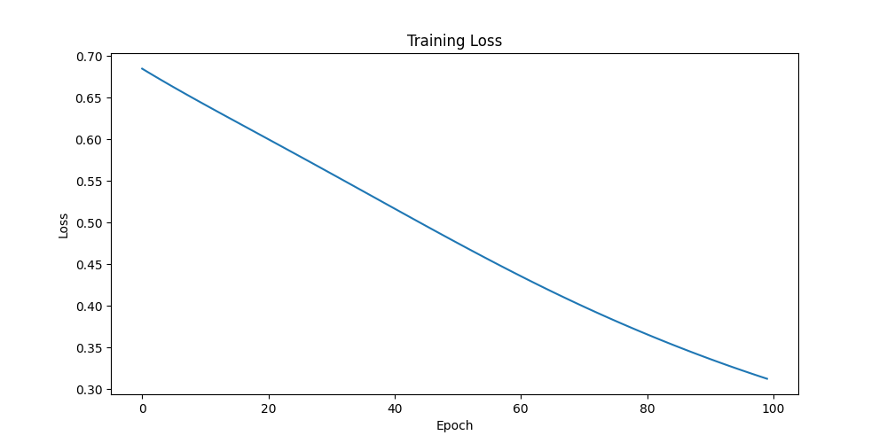
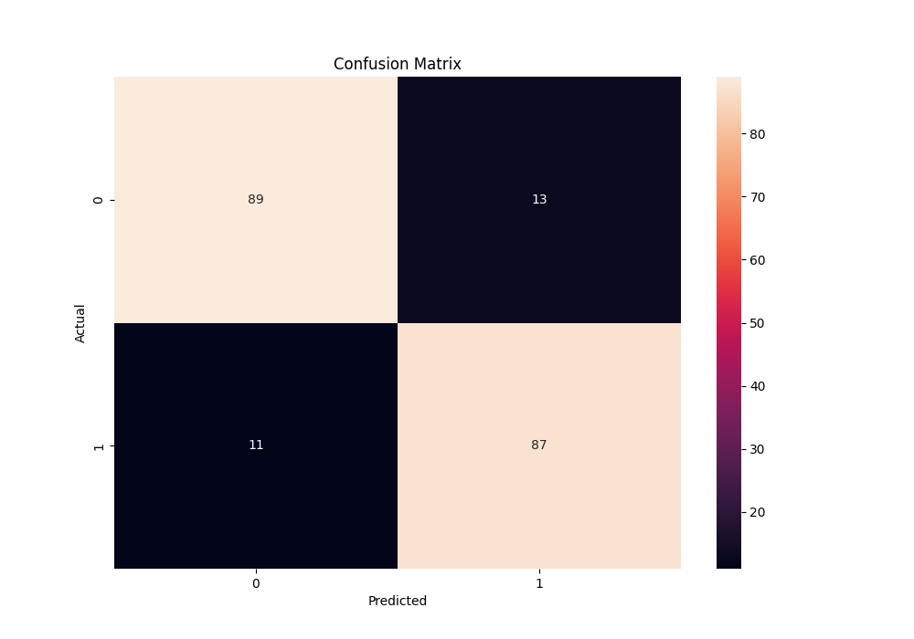

# MLP (Feed Forward DNN) MLOps Project

This project provides a full proof-of-concept (POC) for a Feed Forward Deep Neural Network (MLP) with a focus on MLOps principles. It includes GPU training, model serialization, and inference pipelines, serving as a foundation for more advanced deep learning projects.

## Table of Contents

- [MLP (Feed Forward DNN) Algorithm](#mlp-feed-forward-dnn-algorithm)
  - [Basic Concepts](#basic-concepts)
  - [Mathematical Deduction](#mathematical-deduction)
  - [Real-Life Use Cases](#real-life-use-cases)
- [Project Structure](#project-structure)
- [Installation Guide](#installation-guide)
- [How to Use](#how-to-use)
  - [1. Data Generation](#1-data-generation)
  - [2. Training](#2-training)
  - [3. Inference](#3-inference)
- [Results and Evaluation](#results-and-evaluation)
- [MLOps Integration](#mlops-integration)

## MLP (Feed Forward DNN) Algorithm

### Basic Concepts

A Multi-Layer Perceptron (MLP) is a class of feedforward artificial neural network (ANN). An MLP consists of at least three layers of nodes: an input layer, a hidden layer, and an output layer. Except for the input nodes, each node is a neuron that uses a nonlinear activation function. MLP utilizes a supervised learning technique called backpropagation for training. Its multiple layers and non-linear activation distinguish MLP from a linear perceptron. It can distinguish data that is not linearly separable.

### Mathematical Deduction

For a simple MLP with one hidden layer, the mathematical representation is as follows:

**Forward Propagation:**

The output of the hidden layer is:
$$ h = \sigma(W_1 X + b_1) $$

The output of the network is:
$$ y = \sigma(W_2 h + b_2) $$

Where:
- $X$ is the input vector
- $W_1$ and $W_2$ are the weight matrices for the input and hidden layers, respectively
- $b_1$ and $b_2$ are the bias vectors for the input and hidden layers, respectively
- $\sigma$ is the activation function (e.g., sigmoid or ReLU)
- $h$ is the output of the hidden layer
- $y$ is the final output of the network

**Backward Propagation (Backpropagation):**

The goal of backpropagation is to update the weights and biases to minimize the error (loss). The loss is typically calculated using a loss function, such as Mean Squared Error (MSE) or Cross-Entropy Loss.

The weights are updated using gradient descent:
$$ W_{ij} \leftarrow W_{ij} - \eta \frac{\partial E}{\partial W_{ij}} $$

Where:
- $\eta$ is the learning rate
- $E$ is the error or loss

The partial derivatives are calculated using the chain rule, starting from the output layer and moving backward to the input layer.

### Real-Life Use Cases

MLPs are used in a variety of applications, including:
- **Image Recognition:** Classifying images of objects, animals, etc.
- **Speech Recognition:** Transcribing spoken language into text.
- **Natural Language Processing (NLP):** Sentiment analysis, machine translation, etc.
- **Medical Diagnosis:** Diagnosing diseases based on patient data and medical images.
- **Financial Forecasting:** Predicting stock prices or credit risk.

## Project Structure

```
├── data/
│   └── classification_data.csv
├── images/
├── models/
│   └── mlp_pretrained_1756968483.joblib
├── mlruns/
│   └── ... (MLflow experiment tracking data)
├── notebooks/
├── src/
│   ├── __init__.py
│   ├── data_creation.py
│   ├── predict.py
│   ├── serve_fastapi.py
│   └── train.py
├── .gitignore
├── LICENSE
├── README.md
├── requirements.txt
├── loss_curve.png
└── confusion_matrix.png
```

## Installation Guide

1.  **Clone the repository:**
    ```bash
    git clone <repository-url>
    cd <repository-name>
    ```

2.  **Create a virtual environment (recommended):**
    ```bash
    python -m venv venv
    source venv/bin/activate  # On Windows, use `venv\Scripts\activate`
    ```

3.  **Install the dependencies:**
    ```bash
    pip install -r requirements.txt
    ```

## How to Use

### 1. Data Generation

To generate the synthetic dataset, run the following command:

```bash
python src/data_creation.py
```

This will create a `classification_data.csv` file in the `data` directory.

### 2. Training

To train the MLP model, run the following command:

```bash
python src/train.py
```

This script will:
- Load the dataset.
- Train the MLP model.
- Log the training parameters, metrics, and the trained model to MLflow.
- Generate and save evaluation plots.

To view the MLflow dashboard, run:
```bash
mlflow ui
```
Then open your browser to `http://localhost:5000`.

### 3. Inference

There are two ways to get predictions from the trained model:

**A. Real-time Inference with FastAPI:**

To start the FastAPI server, run:

```bash
uvicorn src.serve_fastapi:app --reload
```

You can then send a POST request to `http://127.0.0.1:8000/predict` with a JSON payload containing the features. For example:

```bash
curl -X POST "http://127.0.0.1:8000/predict" -H "Content-Type: application/json" -d '{"features": [0.5, 0.2, ..., 0.9]}'
```

**B. Batch Inference:**

To make predictions on a batch of data, run:

```bash
python src/predict.py
```

This will print the predictions for a sample of the data.

## Results and Evaluation

The model's performance is evaluated using accuracy and visualized with a loss curve and a confusion matrix.

**Training Loss Curve:**



**Confusion Matrix:**



These plots show that the model is learning effectively, with the loss decreasing over time and a good number of correct predictions on the test set.

## MLOps Integration

This project incorporates several MLOps principles:

- **Experiment Tracking:** MLflow is used to track experiments, including hyperparameters, metrics, and model artifacts. This allows for reproducibility and easy comparison of different model versions.
- **Model Registry:** The trained models are logged to the MLflow Model Registry, providing a central place to manage and version models.
- **Model Serving:** The trained model is served via a REST API using FastAPI, making it easy to integrate into other applications.
- **Reproducibility:** The `requirements.txt` file and the structured project layout ensure that the project is reproducible.
- **Automation:** The scripts for data generation, training, and inference can be easily automated and integrated into a CI/CD pipeline.